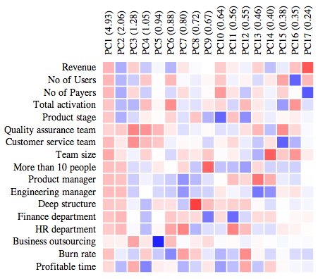

An interactive way to explore 2d arrays
(especially for correlations and coincidences).

[Click here to open it!](http://compassinc.github.io/correlation-explorer/)

# Intro

You can:

* Load any `csv` file with numerical values
(first column and first row specify the labels). 
* Lookup values.
* Sort rows and columns. 
* Explore multidimensional data (e.g. 100 dimensions).

Examples of usage:

* Exploring correlation matrix.
* Looking at projections of variables on principal components.
* Discovering dependencies between two sets of variables (e.g. countries vs diseases).

# License 

[CC-BY](http://creativecommons.org/licenses/by/3.0/)
[Piotr Migdał](http://migdal.wikidot.com/)
at [Compass Inc](https://www.startupcompass.co/).

# Loose notes

## To do

* examples
* polishing sorting
* autodetect of correlation vs count data

### Feature creep

* ? Gray lines when mouse-on
* Importance, principal component, linkage sorts?
* Make sorting more consistent
	* Alphabetic and Orginal as buttons 
* pseudo-symmetric sort, when first one axis, then automatically along the other
* Bootstrap or some other nice interface? Or rather keep it bare-bone?
* Easier search for / filtering variables?
* Some listing of previously loaded csv files?
* Some scales, not only -1 to 1 (so it will be usable also for counts)

### Ideas

* How to work with many variables?
	* Make first n variables bigger?
* If and how allow more datapoints per pixes (e.g. also Spearman correl)
* How to expand it into a 2d scatter/histogram plot per each correlation?
* Show how much position changed?
